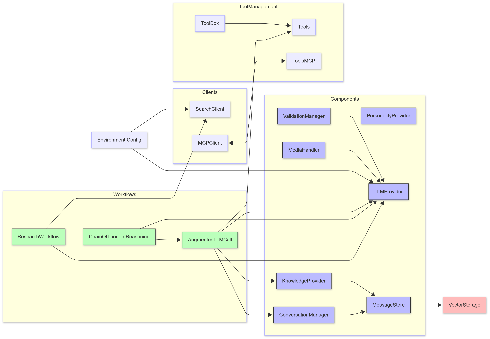

# Heurist Core

Core components of the Heurist Agent Framework for building LLM-powered agents.


## Table of Contents

- [Overview](#overview)
- [Installation](#installation)
- [Environment Variables](#environment-variables)
- [Components](#components)
- [Workflows](#workflows)
- [Tools](#tools)
- [Clients](#clients)
- [Usage Examples](#usage-examples)

## Overview

<div align="center">
    
</div>

Heurist Core is a Python package that provides a set of core components, tools, and workflows for building LLM-powered agents or applications.

Components are designed to be used in conjunction with each other to create a complete agent or application. Enabling easier development by wrapping common patterns and functionality.

Workflows are designed to be used as a starting point for building more complex agents or applications. They enable higher level patterns for agentic systems, such as RAG + tools, Chain of Thought, and more.

## Installation

```bash
pip install heurist-core
```

Or install directly from the repository:

```bash
pip install git+https://github.com/heurist-ai/heurist-agent-framework.git#subdirectory=core
```

## Environment Variables

Copy `.env.example` to `.env` and configure your environment variables:

```bash
cp .env.example .env
```

Required variables:
- `HEURIST_API_KEY`: Your Heurist API key for accessing LLM and other services
- `HEURIST_BASE_URL`: Base URL for Heurist API services

Optional variables:
- `LARGE_MODEL_ID`: ID for the large language model (default: anthropic/claude-3.5-haiku)
- `SMALL_MODEL_ID`: ID for the small language model
- `IMAGE_MODEL_ID`: Model for image generation
- `IMAGE_GENERATION_PROBABILITY`: Probability of generating images (default: 0.3)
- `FIRECRAWL_KEY`: Required only if using search functionality
- See `.env.example` for all available configuration options

## Components

The Heurist Core package provides several core components for building LLM-powered agents.

### LLMProvider

Handles interactions with LLM services. Easily integrates with tools and tool managers for painless tool use.

```python
from heurist_core.components import LLMProvider

llm_provider = LLMProvider(
    base_url=None,              # Optional: API base URL (defaults to HEURIST_BASE_URL env var)
    api_key=None,               # Optional: API key (defaults to HEURIST_API_KEY env var)
    large_model_id=None,        # Optional: Large model ID (defaults to LARGE_MODEL_ID env var)
    small_model_id=None,        # Optional: Small model ID (defaults to SMALL_MODEL_ID env var)
    tool_manager=None           # Optional: Tool manager for executing tools
)

# Basic LLM call
response, image_url, tool_calls = await llm_provider.call(
    system_prompt="You are a helpful assistant.",
    user_prompt="Hello, how are you?",
    temperature=0.7,            # Optional: Controls randomness (default: 0.7)
    max_tokens=None,            # Optional: Maximum tokens to generate
    model_id=None,              # Optional: Override model ID
    skip_tools=True,            # Optional: Skip tool processing (default: True)
    tools=None,                 # Optional: List of tools to use
    tool_choice="auto"          # Optional: Tool choice mode (default: "auto")
)

# LLM call with tools
response, image_url, tool_calls = await llm_provider.call_with_tools(
    system_prompt="You are a helpful assistant.",
    user_prompt="What's the weather?",
    temperature=0.7,
    tools=[...],                # Required: List of tool configurations
    tool_choice="auto"          # Optional: Tool choice mode (default: "auto")
)

# Text classification
classification = llm_provider.classify_text(
    text="This product is amazing!",
    classification_prompt="Classify the sentiment of this text as POSITIVE, NEGATIVE, or NEUTRAL."
)
```

**Dependencies:**
- Environment variables: `HEURIST_API_KEY`, `HEURIST_BASE_URL`, `LARGE_MODEL_ID`, `SMALL_MODEL_ID`
- Optional dependency: `tool_manager` for executing tools

### ConversationManager

Manages conversation context and history.

```python
from heurist_core.components import ConversationManager
from heurist_core.embedding import MessageStore, SQLiteVectorStorage

# Setup storage first
storage = SQLiteVectorStorage()
message_store = MessageStore(storage)

# Initialize conversation manager
conversation_manager = ConversationManager(message_store)

# Get conversation history context
context = await conversation_manager.get_conversation_context(
    chat_id="user123",          # Required: Chat ID to retrieve history for
    limit=10                    # Optional: Maximum number of messages (default: 10)
)

# Get similar messages from previous conversations
similar_context = await conversation_manager.get_similar_messages(
    embedding=[...],            # Required: Message embedding vector
    chat_id="user123",          # Optional: Chat ID to limit search
    threshold=0.9,              # Optional: Similarity threshold (default: 0.9)
    limit=10                    # Optional: Maximum results (default: 10)
)

# Store a conversation interaction
await conversation_manager.store_interaction(
    message="Hello, how are you?",  # Required: User message
    response="I'm doing well!",     # Required: Agent response
    chat_id="user123",              # Required: Chat ID
    metadata={}                     # Optional: Additional metadata
)
```

**Dependencies:**
- `message_store`: Required for storing and retrieving messages
- `get_embedding`: For generating message embeddings

### KnowledgeProvider

Manages knowledge storage and retrieval.

```python
from heurist_core.components import KnowledgeProvider
from heurist_core.embedding import MessageStore, SQLiteVectorStorage

# Setup storage first
storage = SQLiteVectorStorage()
message_store = MessageStore(storage)

# Initialize knowledge provider
knowledge_provider = KnowledgeProvider(message_store)

# Get knowledge context based on message
message = "Tell me about quantum computing"
message_embedding = knowledge_provider.get_embedding(message)
knowledge_context = await knowledge_provider.get_knowledge_context(
    message=message,
    message_embedding=message_embedding
)

# Update knowledge base from JSON file
await knowledge_provider.update_knowledge_base(
    json_file_path="data/quantum_computing.json"  # Path to JSON knowledge file
)
```

**Dependencies:**
- `message_store`: Required for storing and retrieving knowledge
- `get_embedding`: For generating embeddings

### MediaHandler

Handles media processing (images, audio, etc.)

```python
from heurist_core.components import MediaHandler, LLMProvider

# Initialize media handler
media_handler = MediaHandler(llm_provider)

# Generate image prompt
image_prompt = await media_handler.generate_image_prompt(
    message="A futuristic city with flying cars"
)

# Generate image
image_url = await media_handler.generate_image(
    prompt="A futuristic city with flying cars at sunset",
    base_prompt=""  # Optional: Base prompt to prepend
)

# Transcribe audio
text = await media_handler.transcribe_audio(
    audio_file_path="recording.mp3"
)

# Text to speech
audio_path = await media_handler.text_to_speech(
    text="Hello, how can I help you today?"
)

# Check if should generate image
should_generate = media_handler.should_generate_image(
    message="Show me a picture of a sunset"
)
```

**Dependencies:**
- `llm_provider`: Required for generating image prompts
- Environment variables: `BASE_IMAGE_PROMPT`, `IMAGE_GENERATION_PROBABILITY`

### PersonalityProvider

Manages agent personality and prompt configurations.

```python
from heurist_core.components import PersonalityProvider

# Initialize personality provider
personality_provider = PersonalityProvider(
    config_path="prompts.yaml"  # Optional: Path to custom prompts.yaml
)

# Get system prompt
system_prompt = personality_provider.get_system_prompt(
    workflow_type="standard"    # Optional: Workflow type
)

# Get formatted personality
formatted_personality = personality_provider.get_formatted_personality(
    workflow_type="standard"    # Optional: Workflow type
)

# Get agent name
name = personality_provider.get_name()

# Get personality settings
basic_settings = personality_provider.get_basic_settings()
interaction_styles = personality_provider.get_interaction_styles()
```

**Dependencies:**
- `config_path`: Optional path to custom prompts.yaml
- `PromptConfig`: For loading and managing prompt configurations

## Workflows

Workflows combine multiple components to create complex agent behaviors.

### AugmentedLLMCall

Standard RAG + tools pattern.

```python
from heurist_core.workflows import AugmentedLLMCall
from heurist_core.components import KnowledgeProvider, ConversationManager, LLMProvider
from heurist_core.tools import Tools

# Initialize components
knowledge_provider = KnowledgeProvider(message_store)
conversation_manager = ConversationManager(message_store)
tools = Tools()
llm_provider = LLMProvider(tool_manager=tools)

# Initialize workflow
augmented_llm = AugmentedLLMCall(
    knowledge_provider,         # Required: For retrieving knowledge
    conversation_manager,       # Required: For managing conversation context
    tools,                      # Required: For tool execution
    llm_provider                # Required: For LLM calls
)

# Process message
response, image_url, tool_back = await augmented_llm.process(
    message="What are the trending tokens?",  # Required: User message
    system_prompt="",                         # Optional: System prompt override
    personality_provider=None,                # Optional: Personality provider
    chat_id="user123",                        # Optional: Chat ID for context
    workflow_options={                        # Optional: Workflow options
        "use_knowledge": True,                # Use knowledge retrieval (default: True)
        "use_conversation": True,             # Use conversation history (default: True)
        "store_interaction": True,            # Store interaction (default: True)
        "use_similar": True,                  # Use similar message lookup (default: True)
        "use_tools": True,                    # Use tools (default: True)
        "max_tokens": None,                   # Maximum tokens to generate
        "temperature": 0.7,                   # Temperature (default: 0.7)
        "model_id": None,                     # Model ID override
        "tool_choice": "auto"                 # Tool choice mode (default: "auto")
    }
)
```

**Dependencies:**
- `knowledge_provider`: Required for knowledge retrieval
- `conversation_manager`: Required for conversation context
- `tool_manager`: Required for tool execution
- `llm_provider`: Required for LLM calls

### ChainOfThoughtReasoning

Chain of thought reasoning pattern.

```python
from heurist_core.workflows import ChainOfThoughtReasoning, AugmentedLLMCall
from heurist_core.components import LLMProvider
from heurist_core.tools import Tools

# Initialize components
tools = Tools()
llm_provider = LLMProvider(tool_manager=tools)
augmented_llm = AugmentedLLMCall(knowledge_provider, conversation_manager, tools, llm_provider)

# Initialize workflow
chain_of_thought = ChainOfThoughtReasoning(
    llm_provider,               # Required: For LLM calls
    tools,                      # Required: For tool execution
    augmented_llm               # Required: For augmented LLM calls
)

# Process message
response, image_url, _ = await chain_of_thought.process(
    message="What's the current price of Bitcoin?",  # Required: User message
    personality_provider=None,                       # Optional: Personality provider
    chat_id="user123",                               # Optional: Chat ID for context
    workflow_options={                               # Optional: Workflow options
        "temperature": 0.7,                          # Overall temperature (default: 0.7)
        "planning_temperature": 0.1,                 # Planning phase temperature (default: 0.1)
        "execution_temperature": 0.7,                # Execution phase temperature (default: 0.7)
        "final_temperature": 0.7,                    # Final response temperature (default: 0.7)
        "use_conversation": False,                   # Use conversation history (default: False)
        "use_knowledge": False,                      # Use knowledge retrieval (default: False)
        "use_similar": False,                        # Use similar message lookup (default: False)
        "store_interaction": False                   # Store interaction (default: False)
    }
)
```

**Dependencies:**
- `llm_provider`: Required for LLM calls
- `tool_manager`: Required for tool execution
- `augmented_llm`: Required for augmented LLM calls

### ResearchWorkflow

Research workflow for deep web search and analysis.

```python
from heurist_core.workflows import ResearchWorkflow
from heurist_core.components import LLMProvider
from heurist_core.tools import Tools
from heurist_core.clients import SearchClient

# Initialize components
tools = Tools()
llm_provider = LLMProvider(tool_manager=tools)
search_client = SearchClient(
    client_type="firecrawl",    # "firecrawl" or "exa"
    api_key="your_api_key",     # API key for search service
    api_url=None,               # Optional: Custom API URL
    rate_limit=1                # Optional: Rate limit in seconds (default: 1)
)

# Initialize workflow
research_workflow = ResearchWorkflow(
    llm_provider,               # Required: For LLM calls
    tools,                      # Required: For tool execution
    search_client               # Required: For search queries
)

# Process research query
report, _, research_results = await research_workflow.process(
    message="Latest developments in quantum computing",  # Required: Research query
    personality_provider=None,                          # Optional: Personality provider
    chat_id=None,                                       # Optional: Chat ID
    workflow_options={                                  # Optional: Workflow options
        "interactive": False,                           # Ask clarifying questions (default: False)
        "breadth": 3,                                   # Number of parallel searches (default: 3)
        "depth": 2,                                     # How deep to go in research (default: 2)
        "concurrency": 3,                               # Max concurrent requests (default: 3)
        "temperature": 0.7,                             # Temperature (default: 0.7)
        "raw_data_only": False                          # Return only raw data (default: False)
    }
)
```

**Dependencies:**
- `llm_provider`: Required for LLM calls
- `tool_manager`: Required for tool execution
- `search_client`: Required for search queries
- Environment variables: `FIRECRAWL_KEY` or `EXA_API_KEY` (depending on client)

## Tools

Tools enable agents to interact with external systems and services. Tools enables extendibility and modularity, while enabling easier tool execution and management.

### ToolBox

Generic tool execution framework.

```python
from heurist_core.tools import ToolBox, Tools, tool

# Create a custom toolbox by inheriting from ToolBox
class MyToolBox(ToolBox):
    def __init__(self):
        super().__init__()

        # Define a tool using the decorator
        @tool(description="Performs arithmetic operations")
        def calculator(expression: str) -> dict:
            """Calculate the result of a mathematical expression."""
            try:
                result = eval(expression)
                return {"result": result}
            except Exception as e:
                return {"error": str(e)}

        # Add the decorated tool to the toolbox
        self.decorated_tools.append(calculator)

# Initialize Tools with your custom toolbox
tools = Tools(MyToolBox)

# Initialize LLM provider with tools
llm_provider = LLMProvider(tool_manager=tools)

# Now the LLM can use the calculator tool automatically when needed
response, _, tool_calls = await llm_provider.call(
    system_prompt="You are a helpful assistant with access to a calculator.",
    user_prompt="What is 234 * 456?",
    skip_tools=False  # Enable tool usage
)
```

### Tools (MCP)

Tools integration with MCP. Tools MCP enables simple tool management and execution for Heurist Mesh agents and any other MCP Servers.

```python
from heurist_core.tools.tools_mcp import Tools
from heurist_core.components import LLMProvider

# Initialize MCP tools
tools = Tools()

# Initialize MCP connection
await tools.initialize(server_url="https://sequencer-v2.heurist.xyz/tool51d0cadd/sse")

# Initialize LLM provider with MCP tools
llm_provider = LLMProvider(tool_manager=tools)

# Now the LLM can use any available MCP tools automatically
response, _, tool_calls = await llm_provider.call(
    system_prompt="You are a helpful assistant with access to various tools.",
    user_prompt="What's the weather in New York?",
    skip_tools=False  # Enable tool usage
)

# Don't forget to clean up when done
await tools.cleanup()
```

**Dependencies:**
- `mcp`: For MCP integration
- Environment variables: None required, but tool-specific env vars may be needed

## Clients

Clients for external services.

### SearchClient

Unified search client for web search.

```python
from heurist_core.clients import SearchClient

# Initialize search client with Firecrawl
firecrawl_client = SearchClient(
    client_type="firecrawl",    # Required: "firecrawl" or "exa"
    api_key="your_api_key",     # Required: API key
    api_url=None,               # Optional: Custom API URL
    rate_limit=1                # Optional: Rate limit in seconds (default: 1)
)

# Initialize search client with Exa
exa_client = SearchClient(
    client_type="exa",          # Required: "firecrawl" or "exa"
    api_key="your_api_key",     # Required: API key
    api_url=None,               # Optional: Custom API URL
    rate_limit=1                # Optional: Rate limit in seconds (default: 1)
)

# Execute search
search_results = await firecrawl_client.search(
    query="Latest developments in AI",  # Required: Search query
    timeout=15000                      # Optional: Timeout in milliseconds (default: 15000)
)

# Update rate limit
firecrawl_client.update_rate_limit(rate_limit=2)
```

**Dependencies:**
- For "firecrawl" client: `firecrawl` package
- For "exa" client: No additional packages, uses `requests`

### MCPClient

Client for MCP Protocol, facilitating communication and interaction with MCP Servers.

```python
from heurist_core.clients import MCPClient

# Initialize MCP client
mcp_client = MCPClient(
    server_url="https://sequencer-v2.heurist.xyz/tool51d0cadd/sse"  # Required: MCP server URL
)

# Start connection
await mcp_client.start()

# Send message
await mcp_client.send(
    message="Hello world",      # Message content
    mcp_type="text"             # Optional: Message type (default: "text")
)

# Close connection
await mcp_client.close()
```

**Dependencies:**
- `mcp`: For MCP integration

## Usage Examples

Here are some examples of how to use the Heurist Core package:

### Basic LLM Call

```python
from heurist_core.components import LLMProvider
import os
import asyncio

async def main():
    # Initialize LLM provider
    llm_provider = LLMProvider()

    # Make a simple LLM call
    response, _, _ = await llm_provider.call(
        system_prompt="You are a helpful assistant.",
        user_prompt="Hello, how are you?"
    )

    print(response)

# Run the async main function
if __name__ == "__main__":
    asyncio.run(main())
```

### Research Workflow

```python
from heurist_core.workflows import ResearchWorkflow
from heurist_core.components import LLMProvider
from heurist_core.tools.tools_mcp import Tools
from heurist_core.clients import SearchClient
import os
import asyncio

async def main():
    # Initialize components
    search_client = SearchClient(client_type="firecrawl", api_key=os.getenv("FIRECRAWL_KEY"))
    tools = Tools()
    llm_provider = LLMProvider(tool_manager=tools)

    # Initialize research workflow
    research_workflow = ResearchWorkflow(llm_provider, tools, search_client)

    # Process research query
    report, _, _ = await research_workflow.process(
        message="Latest bitcoin news?",
        workflow_options={
            "breadth": 3,
            "depth": 2
        }
    )

    print(report)

# Run the async main function
if __name__ == "__main__":
    asyncio.run(main())
```

### Chain of Thought Reasoning

```python
from heurist_core.workflows import ChainOfThoughtReasoning
from heurist_core.components import LLMProvider, ConversationManager, KnowledgeProvider
from heurist_core.embedding import MessageStore, SQLiteVectorStorage, SQLiteConfig
from heurist_core.tools.tools_mcp import Tools
import asyncio

async def main():
    # Setup storage and components
    config = SQLiteConfig()
    storage = SQLiteVectorStorage(config)
    message_store = MessageStore(storage)

    # Initialize components
    tools = Tools()
    knowledge_provider = KnowledgeProvider(message_store)
    conversation_manager = ConversationManager(message_store)
    llm_provider = LLMProvider(tool_manager=tools)

    # Initialize augmented LLM for sub-tasks
    augmented_llm = AugmentedLLMCall(knowledge_provider, conversation_manager, tools, llm_provider)

    # Initialize chain of thought workflow
    chain_of_thought = ChainOfThoughtReasoning(llm_provider, tools, augmented_llm)

    # Complex reasoning task
    query = """
    Given the current market conditions:
    1. Analyze recent Bitcoin price movements
    2. Check relevant news and sentiment
    3. Consider technical indicators
    4. Evaluate market liquidity

    What is your short-term price prediction for Bitcoin?
    """

    # Process with chain of thought reasoning
    response, _, tool_calls = await chain_of_thought.process(
        message=query,
        workflow_options={
            "planning_temperature": 0.1,      # Lower temperature for structured planning
            "execution_temperature": 0.7,     # Higher temperature for creative analysis
            "final_temperature": 0.5,         # Balanced temperature for final response
            "use_tools": True                 # Enable tool usage for data gathering
        }
    )

    print("Chain of Thought Analysis:")
    print(response)

    if tool_calls:
        print("\nTools Used:")
        print(tool_calls)

# Run the async main function
if __name__ == "__main__":
    asyncio.run(main())
```

This example demonstrates:
1. Complex multi-step reasoning
2. Tool integration for data gathering
3. Temperature control for different reasoning phases
4. Structured planning and execution
5. Tool call tracking and reporting

### Conversation with Memory

```python
from heurist_core.workflows import AugmentedLLMCall
from heurist_core.components import LLMProvider, ConversationManager, KnowledgeProvider
from heurist_core.embedding import MessageStore, SQLiteVectorStorage, SQLiteConfig
from heurist_core.tools.tools_mcp import Tools
import asyncio

async def main():
    # Setup storage
    config = SQLiteConfig()
    storage = SQLiteVectorStorage(config)
    message_store = MessageStore(storage)

    # Initialize components
    tools = Tools()
    knowledge_provider = KnowledgeProvider(message_store)
    conversation_manager = ConversationManager(message_store)
    llm_provider = LLMProvider(tool_manager=tools)

    # Initialize workflow
    augmented_llm = AugmentedLLMCall(knowledge_provider, conversation_manager, tools, llm_provider)

    # Process first message
    response1, _, _ = await augmented_llm.process(
        message="Hello, my name is Alice.",
        chat_id="user123"
    )
    print(f"Response 1: {response1}")

    # Process second message (with memory)
    response2, _, _ = await augmented_llm.process(
        message="What's my name?",
        chat_id="user123"
    )
    print(f"Response 2: {response2}")

# Run the async main function
if __name__ == "__main__":
    asyncio.run(main())
```

For more examples, see the `examples/` directory.

## License

MIT
